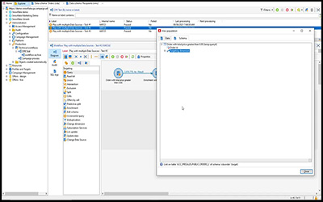
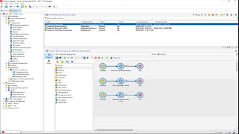

# Adobe Campaign v8 クライアントコンソールチュートリアル

Adobe Campaign は、クロスチャネルのカスタマーエクスペリエンスを設計するためのプラットフォームであり、視覚的なキャンペーンオーケストレーション、リアルタイムインタラクション管理およびクロスチャネル実行のための環境を提供します。 このユーザーガイドには、Adobe Campaign V8 クライアントコンソールの数々の特長や機能に関するビデオとチュートリアルが含まれています。

参照

>[!INFO]
> 質問はありますか？ 同僚と経験を共有したり、意見交換したりしますか？ または、アドビチームの学習コンテンツに関するフィードバックはありますか？ [Adobe Campaign の学習コミュニティスレッド](https://experienceleaguecommunities.adobe.com:443/t5/adobe-campaign-classic/join-the-discussion-on-adobe-campaign-learning/td-p/419096)で会話にご参加ください。
> 
> これらのチュートリアルは、お探しのものではありませんか？
> Campaign web ユーザーインターフェイスの使用方法のガイダンスについて詳しくは、[Adobe Campaign web ユーザーインターフェイスチュートリアル](https://experienceleague.adobe.com/docs/campaign-web-learn/tutorials/overview.html?lang=ja)を参照してください。

>[!NOTE]
> Campaign v8 は、現在 Managed Cloud Service としてのみ利用でき、オンプレミス環境またはハイブリッド環境にデプロイすることはできません。 既存の Campaign Classic v7 環境からの自動移行はまだ利用できません。
>
>Classic v7 から V8 への移行について詳しくは、[製品ドキュメント](https://experienceleague.adobe.com/docs/campaign/campaign-v8/new/v7-to-v8.html?lang=ja)を参照してください。

## スタッフのおすすめ

<table>
<tr>
  <td>
    
    

      <a href="/help/get-started/create-a-marketing-plan-programs-and-campaigns.md">
    <strong>マーケティングプランの作成</strong>
    </a>
    

    

    <em>マーケティングプラン、プログラム、キャンペーンの作成方法を説明します。</em>
    

  </td>
   <td>
    
    

      <a href="./content-creation/create-and-design-email-deliveries.md">
    <strong>メール配信の作成とデザイン</strong>
    </a>
    

    

    <em>メール配信を作成するプロセスを理解し、メールコンテンツをデザインおよびパーソナライズする方法について説明します。
</em>
    

  </td>
  <td>
    
    

      <a href="./send-messages/fatigue-management/typology-rules-for-fatigue-management.md">
    <strong>タイポロジルールを使用した疲労管理</strong>
    </a>
    

    

    <em>タイポロジルールを使用して Adobe Campaign に疲労管理を実装する方法について説明します。</em>
    

  </td>
</tr>
<tr>
</td>
  <td>
    
    

      <a href="./reporting/generate-a-descriptive-analysis-report.md">
    <strong>記述的分析レポートの生成</strong>
    </a>
    

    

    <em>ワークフローから記述的分析レポートを生成する方法について説明します。</em>
    

  </td>
  <td>
   
     

      <a href="./data-management/data-management-fundamentals.md">
    <strong>ワークフローを使用したデータ管理の基本</strong>
    </a>
    

    

    <em>ターゲティングディメンションと作業用テーブルの概要と、Adobe Campaign で様々なデータソースにわたるデータを管理する方法について説明します。</em>
    

  </td>
  <td>
   
     

      <a href="./data-management/api-staging-mechanism.md">
    <strong>FFDA を使用した API ステージングメカニズム</strong>
    </a>
    

    

    <em>フル FDA を使用した API ステージングメカニズムの仕組みについて説明します。</em>
    

  </td>
</tr>
</table>

