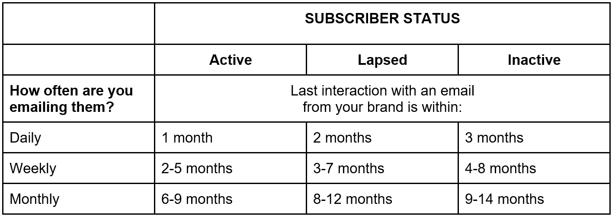

# 購読者の再エンゲージメントに関するメールの ROI とベストプラクティス

電子メールマーケティングは、ブランドロイヤリティの開発と売上の増加に役立つツールです。 しかし、人々が毎日受け取るメールの数は多く、消費している他のデジタルコンテンツも言うまでもなく、コンテンツが群衆の中から際立つことが重要です。 そして、オーディエンスのユニークなニーズを満たすことが重要です。

この記事では、4 つの戦略をレビューして、購読者のエンゲージメントと電子メールキャンペーンの全体的な成功を改善します。 また、E メールの疲労、オーディエンス内での疲労の特定方法、購読者のエクスペリエンスを向上させるためにおこなう簡単な手順についても説明します。

## 配信品質とは何でしょうか。

用語の配信と配信品質で混同が生じる可能性があります。 配信品質は、E メールキャンペーンの成功の指標です。購読者の受信トレイ、迷惑メールフォルダー、または ISP によってブロックされたフォルダーのどれに配信されるか。 数式と見なすと、E メールを送信し、受信トレイにランディングする機能と継続的にそれを行う能力が必要になります。

E メールキャンペーンの配信品質は、組織でどの程度追跡されていますか。また、E メールの最終的な位置はわかっていますか。

## スパムフィルター

戦略を立てる前に、キャンペーンの結果に影響を与える可能性のある、最も一般的なスパムフィルターの問題を把握しておくことが重要です。 E メールを開封していない非アクティブな購読者に E メールを 1 年以上送信し続ける場合は、次の点に注意してください。

* ブロックリスト
* コンテンツフィルター
* IP とドメインのレピュテーション
* 認証
* 苦情
* ユーザーアクション

## メールの ROI を最大化

インターネット上で 1 分で 100 万件を超えるビデオ視聴Googleでの検索クエリ 200 万件Facebookでの閲覧数 600 万件送信された電子メール数 2 億件を超えることをご存じでしたか？ このような状況が続く中で、コンテンツがノイズによって失われないようにすることが重要です。 特に、ホリデーシーズン中にキャンペーンを作成する場合、見込み客とリピート客の前で E メールを受信するのはさらに困難です。

11 月から 1 月上旬にかけて、送信されるマーケティング E メールの量が大幅に増加します。 メールボックスプロバイダー (ISP) は、今年の残りの期間よりも多くのトラフィックをサーバーに送信し、その結果、顧客（購読者）の保護に関する警戒をさらに強化します。

次に、ROI を最大化する 4 つの主な戦略を示します。

### 1.コンテンツカレンダーを準備する

* ISP は、IP アドレスからの平均送信を追跡するので、赤いフラグの作成やスパムへの送信を避けるために、できる限りボリュームを配分します
* コンテンツカレンダーを事前に設定し、送信量を増やすためにコンテンツ作成者に準備します
* E メールのスケジュールを設定し、送信量の大幅な急増を避ける方法について考えてみましょう。 次のようないくつかの戦術を考えてみます。
   * 同時に送るのではなく、数日以上にわたって送る爆風
   * 午前 8 時～午前 10 時など、過負荷のメールを受け取る時間帯に戦略的に計画します
   * 何日間にもわたって広められない場合は、何時間もお試しください

### 2.インフラ

* 独自の E メールでテストを実行し、E メール認証が正しく設定されていることを確認します
* バウンスの処理について確認し、ISP 全体でのパフォーマンスを確認します。
   * 特定の ISP で発生する可能性のある問題やブロックはありますか？
   * 大量の送信を開始する前に問題を把握し、不快な予想やキャンペーンのパフォーマンスの低下を防ぎます。

### 3.データ

* すべての獲得テクニック、特にサインアッププロセスと GDPR を特定します。
* 購読者に E メールアドレスを求める際は、できるだけ透明にしてください。
   * 送信するコンテンツ（ニュースレター、プロモーション、イベント）
   * 送信する電子メールの数（日別、週別、月別）

* 新規購読者にお知らせメールを送信する：
   * ようこそメールは、購読者が新しいコンテンツによって不意に意図されずに配信を停止したり、スパムとしてマークしたりしないようにするのに役立ちます。
   * ようこそメールも、パフォーマンスの良い指標です。 配信やインタラクションが成功しない場合は、パフォーマンスが低下したり、データ収集が低下したりしている可能性があります。

### 4.メール管理

* 購読者をセグメント化し、ブランドライフサイクル内の位置を監視する
* コンテンツのパーソナライゼーション戦略を使用して E メールの関連性を向上

## E メールのエンゲージメントを高め、E メールの疲労を解決する方法

E メール疲労は、購読者が E メールメッセージの受信に疲れた場合に発生します。 E メールの疲労は、様々な理由で発生する可能性があります。長い間リストに載っていたので、あなたからの連絡に疲れているか、最新のコンテンツが関連しなくなった可能性があります。 電子メールで疲労が発生している顧客とその理由を特定するのは、ユーザーとチーム次第です。 では何を目指すべきか？

監視する主な指標は次のとおりです。

* 開封率を下げる
* クリック率の低下
* 購読解除率の向上

残念ながら、E メールの疲労を経験するほとんどの購読者は、簡単にはできません。 コンテンツに満足できないという明確なフラグを持ち、配信を停止することはありません。 多くの場合、電子メールを削除したり無視したりするだけで、エンゲージしていない購読者の開封数が表示されることがあります。 つまり、購読者の習慣の変化に反応しないと、送信者の評判が損なわれ、最終的に全体的な成功が損なわれる可能性があります。

その点を念頭に置いて、購読者をエンゲージメント状態に保ち、受信するコンテンツのタイプを予測する、購読解除や非アクティブなオーディエンスを避けるためのベストプラクティスをいくつか示します。

### 1.電子メールの頻度に関する戦略を策定する

残念ながら、1 週間に送信するメール数に関する正しい答えはありません。 適切な番号を見つけるには、次の点を考慮します。

* カスタマーライフサイクルのお客様の所在地
* メールとの関わりは？
   * バスケットの放棄に関する E メールとニュースレターの比較
   * 再アクティベーションメールとセールの開始
   * バスケットの放棄に関する E メールと新しい製品のローンチ
* 顧客がブランドからコンテンツを受け取る能力はどれくらいですか？
* お客様の季節ごとの好みは何ですか？

### 2.購読者のステータスを特定する

購読者のステータス（アクティブ、重複、非アクティブ）は、購読者のコンテンツを送信する頻度に応じて異なります。 ここから、顧客の関与方法を決定できます。

監査時に役立つ簡単な表を次に示します。

例えば、毎日電子メールを送信する場合、顧客は過去 1 ヶ月以内にこれらの電子メールの 1 つとやり取りし、アクティブでエンゲージ済みと見なす必要があります。 逆に、顧客に月々メールを送信していて、9 ～ 14 ヶ月以内にインタラクションをおこなっていない場合、顧客は非アクティブと見なすことができます。

失効したユーザーと非アクティブなユーザーの場合は、ユーザーが購読した日付を調べて、エンゲージメントレベルを判断することを検討します。 例えば、コンテストや他のマーケティングキャンペーンの日に購読したか。 Web サイトのポップアップから、割引オファーを使用してサインアップしたか。 過剰なユーザーと非アクティブなユーザーを特定したら、戦略を変更して、ユーザーの満足度を向上させ、それらをアクティブな購読者に戻すことが重要です。

### 3.再エンゲージメント戦略の実装

このプロセスを次の 2 つの領域に分類します。a) E メールの送信パターン、b)E メール自体のクリエイティブコンテンツ。 以下に、これらの各領域の詳細を示します。

**送信パターンとスケジュールを更新する**

* **ゆっくり開始**  — スプリントではなくマラソンですね。 1 日で実装できるソリューションではありません。 オーディエンスのごく一部（4～5 %程度）から始めて、パフォーマンスを慎重に監視することを検討します。

* **ブランドレピュテーションの検討**  — 非アクティブなセグメントへの E メールトラフィックが、レピュテーションの問題を引き起こさないようにします。

* **ワークフローの自動化**  — リストを清潔に保ちます。

* **頻度ルール**  — 再エンゲージメントプログラムの購読者を他の E メールの受信から除外します。

**クリエイティブとコンテンツ**

* **明確なオプトイン/オプトアウトをオファー**  — ユーザーが、自分から連絡を取りたいかどうかをすばやく簡単に判断できるようにします。 エンゲージメントのビジネスニーズに重点を置くのではなく、最初にそのニーズに応えるオプトインを受け取ることができます。

* **環境設定センターの作成**  — 購読者をさらに制御し、ニュースレター、プロモーションオファー、イベントなどの様々な E メールコンテンツや、異なる規則性から選択できる機会です。 これを提供する場合は、必ずフォロースルーして、オーディエンスを適切にセグメント化し、それらの設定を満たすようにしてください。

* **強い件名行**  — 他のブランドコンテンツと比較して優れていることを確認します。

* **テストと学習** ・取り組みが望ましい効果を発揮しているかを確かめるためには、適切なテスト計画が重要です。 動作内容と動作内容を学び、それに応じて繰り返します。

この記事の概要と再エンゲージメント戦略の実装に関する実際のデモについては、 [ウェビナー](https://adobecustomersuccess.adobeconnect.com/pm8goho13xuy/).

戦略と思考のリーダーシップに関する詳細は、 [顧客の成功](https://experienceleague.corp.adobe.com/docs/customer-success/customer-success/overview.html) ハブ。
