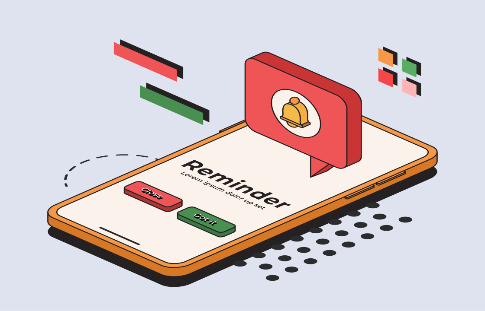

# マーケター向けの基本を学ぶ

このガイドでは、Campaign v8 の主な機能の概要について説明します。 Campaign Standard から Campaign v8 に移行するマーケターを対象としています。

Adobe Campaign v8 には、クライアントコンソールまたは web ユーザーインターフェイスからアクセスできます。 Web インターフェイスを使用すると、主なマーケティングアクションを作成、管理、実行できます。

>[!NOTE]
> Adobe Campaign web ユーザーインターフェイスのリリースは、機能のデプロイメントに対して、よりスケーラブルで段階的なアプローチを実現できる継続的配信モデルに基づいて動作します。 最新の更新については、定期的に[リリースノート](https://experienceleague.adobe.com/ja/docs/campaign-web/v8/release-notes/release-notes)を参照してください。

## Campaign web ユーザーインターフェイスへのアクセスと探索

>[!VIDEO](https://video.tv.adobe.com/v/3427278?quality=12&learn=on){transcript=true}

* [インターフェイスの確認](https://experienceleague.adobe.com/ja/docs/campaign-web/v8/start/user-interface)
* [リストの参照とフィルター](https://experienceleague.adobe.com/ja/docs/campaign-web/v8/start/list-filters)

## ヘルプとガイダンスの検索

[Adobe Campaign web ユーザーインターフェイスドキュメント](https://experienceleague.adobe.com/ja/docs/campaign-web/v8/campaign-web-home)

## プロファイルとオーディエンスの作成と管理

### オーディエンス管理

Campaign v8 でオーディエンスを作成および管理する一般的な概念は、Adobe Campaign Standard と同じです。

#### プロファイル

Campaign web ユーザーインターフェイスを使用してプロファイルにアクセス、管理および探索する方法について説明します。

>[!VIDEO](https://video.tv.adobe.com/v/3427293?quality=12&learn=on){transcript=true}

詳しくは、[&#x200B; プロファイルの基本を学ぶ](https://experienceleague.adobe.com/ja/docs/campaign-web/v8/audiences/work-with-profiles/about-recipients){target="_blank"}を参照してください。

#### オーディエンス

オーディエンスの作成と管理方法、配信用のオーディエンスの選択方法、コントロール母集団の定義方法について説明します。

>[!VIDEO](https://video.tv.adobe.com/v/3425861?quality=12&learn=on){transcript=true}

詳しくは、[&#x200B; オーディエンスの基本を学ぶ](https://experienceleague.adobe.com/ja/docs/campaign-web/v8/audiences/audiences/manage-audience){target="_blank"}を参照してください。

### テストプロファイル

[テストプロファイルの作成と管理](https://experienceleague.adobe.com/ja/docs/campaign-web/v8/audiences/work-with-profiles/test-profiles){target="_blank"}

### 購読を管理

Adobe Campaign Web を使用すると、ニュースレターなどのサービスの管理と作成を行ったり、それらのサービスの購読または登録解除を確認したりできます。 詳細情報：

<table style="table-layout:fixed"><tr style="border: 0;">
<td>

<a href="https://experienceleague.adobe.com/ja/docs/campaign-web/v8/audiences/work-with-services/manage-services"><strong>購読サービスの作成</strong></a>

</td>
<td>

<a href="https://experienceleague.adobe.com/ja/docs/campaign-web/v8/audiences/work-with-services/manage-subscribers"><strong>購読者の管理<strong></strong></a>

</td>
<td>

<a href="https://experienceleague.adobe.com/ja/docs/campaign-web/v8/msg/send-to-subscribers"><strong>メッセージをサービスのサブスクライバーに送信</strong></a>

</td>
</tr>
</table>

## クロスチャネルキャンペーンとワークフローの作成と管理

### キャンペーンの概要

[&#x200B; キャンペーン &#x200B;](https://experienceleague.adobe.com/ja/docs/campaign-web/v8/campaigns/gs-campaigns)に関する製品ドキュメントを参照してください

### ワークフローの作成

1. ワークフローの仕組みと、ターゲティングワークフローの作成方法を説明します。

   >[!VIDEO](https://video.tv.adobe.com/v/3425873?quality=12&learn=on){transcript=true}

1. [ワークフローアクティビティの操作](https://experienceleague.adobe.com/ja/docs/campaign-web/v8/wf/design-workflows/about-activities){target="_blank"}
1. [ワークフローのガードレールと制限](https://experienceleague.adobe.com/ja/docs/campaign-web/v8/wf/guardrails){target="_blank"}

## 配信の作成と管理

### メール配信

メール配信をゼロから作成し、オーディエンスの定義、コンテンツの設計、プレビューのシミュレートを行い、配達確認を送信する方法について説明します。

>[!VIDEO](https://video.tv.adobe.com/v/3425866?quality=12&learn=on){transcript=true}

#### &#x200B;1. コンテンツのデザインと定義

メールデザイナーの操作方法について説明します。 メールをゼロから構造化して設計する方法と、メールをパーソナライズしてテストする方法ついて説明します。

>[!VIDEO](https://video.tv.adobe.com/v/3425867?quality=12&learn=on){transcript=true}

HTML をアップロードしてメールを作成する方法、E メールデザイナーと互換性を持たせる方法、テンプレートに変換する方法について説明します。

>[!VIDEO](https://video.tv.adobe.com/v/3427633?quality=12&learn=on){transcript=true}

#### &#x200B;2. プレビューとテスト

メールメッセージのコンテンツとパーソナライゼーションをプレビューし、テスト配信（配達確認）を送信し、一般的なデスクトップ、モバイル、web ベースのクライアントでメールのレンダリングを確認する方法について説明します。

>[!VIDEO](https://video.tv.adobe.com/v/3425862?quality=12&learn=on){transcript=true}

#### &#x200B;3. メール送信とログ確認

<!--
CARDS
   * https://experienceleague.adobe.com/en/docs/campaign-web/v8/msg/email/monitor/prepare-send
   * https://experienceleague.adobe.com/en/docs/campaign-web/v8/msg/email/monitor/schedule-sending
   * https://experienceleague.adobe.com/en/docs/campaign-web/v8/msg/email/monitor/delivery-logs
-->
<!-- START CARDS HTML - DO NOT MODIFY BY HAND -->

    

        

            

                <figure class="image x-is-16by9">
                    
                </figure>
            

            

                

                    

                        <a href="https://experienceleague.adobe.com/ja/docs/campaign-web/v8/msg/email/monitor/schedule-sending" target="_blank" rel="referrer" title="配信の送信のスケジュール設定">配信の送信のスケジュール設定</a>
                    

                    
配信をスケジュール設定する方法について説明します

                

                <a href="https://experienceleague.adobe.com/ja/docs/campaign-web/v8/msg/email/monitor/schedule-sending" target="_blank" rel="referrer" class="spectrum-Button spectrum-Button--outline spectrum-Button--primary spectrum-Button--sizeM" style="align-self: flex-start; margin-top: 1rem;">
                    詳細情報
                </a>
            

        

    

    

        

            

                <figure class="image x-is-16by9">
                    
                </figure>
            

            

                

                    

                        <a href="https://experienceleague.adobe.com/ja/docs/campaign-web/v8/msg/email/monitor/delivery-logs" target="_blank" rel="referrer" title="配信ログの監視">配信ログの監視</a>
                    

                    
配信ログの監視方法について説明します

                

                <a href="https://experienceleague.adobe.com/ja/docs/campaign-web/v8/msg/email/monitor/delivery-logs" target="_blank" rel="referrer" class="spectrum-Button spectrum-Button--outline spectrum-Button--primary spectrum-Button--sizeM" style="align-self: flex-start; margin-top: 1rem;">
                    詳細情報
                </a>
            

        

    

<!-- END CARDS HTML - DO NOT MODIFY BY HAND -->

### SMS 配信

<table style="table-layout:fixed"><tr style="border: 0;">
<td>

<a href="https://experienceleague.adobe.com/ja/docs/campaign-web/v8/msg/sms/create-sms"><strong>SMS 配信を作成</strong>

</td>
<td>

<a href="https://experienceleague.adobe.com/ja/docs/campaign-web/v8/msg/sms/content-sms"><strong>SMS 配信をデザイン<strong></strong></a>

</td>
<td>

<a href="https://experienceleague.adobe.com/ja/docs/campaign-web/v8/msg/sms/send-sms"><strong>SMS 配信のプレビューと送信</strong></a>

</td>
</tr></table>

### プッシュ通知の作成と管理

Adobe Campaign v8 では、Android™ と iOS の両方のプッシュチャネルをサポートしています。 プッシュチャネルを使用している既存のワークフローと配信を移行するには、Adobe Campaign トランジショマネージャーにお問い合わせください。

<table style="table-layout:fixed"><tr style="border: 0;">
<td>

<a href="https://experienceleague.adobe.com/ja/docs/campaign-web/v8/msg/push/create-push"><strong>プッシュ配信を作成</strong>

</td>
<td>

<a href="https://experienceleague.adobe.com/ja/docs/campaign-web/v8/msg/push/content-push"><strong>プッシュ配信をデザイン<strong></strong></a>

</td>
<td>

<a href="https://experienceleague.adobe.com/ja/docs/campaign-web/v8/msg/push/send-push"><strong>プッシュ配信のプレビューと送信</strong></a>

</tr></table>

### ダイレクトメール

1. [ダイレクトメール配信の作成](https://experienceleague.adobe.com/ja/docs/campaign-web/v8/msg/direct-mail/create-direct-mail)
2. [&#x200B; コンテンツを定義](https://experienceleague.adobe.com/ja/docs/campaign-web/v8/msg/direct-mail/content-direct-mail){target="_blank"}
3. [プレビューと送信](https://experienceleague.adobe.com/ja/docs/campaign-web/v8/msg/direct-mail/send-direct-mail){target="_blank"}

### 配信のベストプラクティス

* [配信テンプレートを使用](https://experienceleague.adobe.com/ja/docs/campaign-web/v8/msg/delivery-template){target="_blank"}

## ランディングページの作成と管理

<table style="table-layout:fixed"><tr style="border: 0;">
<td>

<a href="https://experienceleague.adobe.com/ja/docs/campaign-web/v8/landing-pages/create-lp"><strong>ランディングページの作成</strong>

</td>
<td>

<a href="https://experienceleague.adobe.com/ja/docs/campaign-web/v8/landing-pages/lp-content"><strong>ランディングページの設計</strong></a>

</td>
<td>

<a href="https://experienceleague.adobe.com/ja/docs/campaign-web/v8/landing-pages/lp-templates"><strong>ランディングページテンプレートの操作</strong></a>

</td>
</tr></table>

## コンテンツ管理

<!--
CARDS
* https://experienceleague.adobe.com/en/docs/campaign-web/v8/content/dynamic-content/personalize
* https://experienceleague.adobe.com/en/docs/campaign-web/v8/content/dynamic-content/conditions
* https://experienceleague.adobe.com/en/docs/campaign-web/v8/content/manage-reusable-content/content-templates/create-email-templates
* https://experienceleague.adobe.com/en/docs/campaign-web/v8/content/manage-reusable-content/fragments/fragments
* https://experienceleague.adobe.com/en/docs/campaign-web/v8/msg/offers
-->
<!-- START CARDS HTML - DO NOT MODIFY BY HAND -->

    

        

            

                <figure class="image x-is-16by9">
                    
                </figure>
            

            

                

                    

                        <a href="https://experienceleague.adobe.com/en/docs/campaign-web/v8/content/dynamic-content/personalize" target="_blank" rel="referrer" title="Campaign でのコンテンツのパーソナライズ"> キャンペーンでコンテンツをパーソナライズ </a>
                    

                    
Adobe Campaign Web でのコンテンツのパーソナライズ方法について説明します

                

                <a href="https://experienceleague.adobe.com/en/docs/campaign-web/v8/content/dynamic-content/personalize" target="_blank" rel="referrer" class="spectrum-Button spectrum-Button--outline spectrum-Button--primary spectrum-Button--sizeM" style="align-self: flex-start; margin-top: 1rem;">
                    詳細情報
                </a>
            

        

    

    

        

            

                <figure class="image x-is-16by9">
                    
                </figure>
            

            

                

                    

                        <a href="https://experienceleague.adobe.com/en/docs/campaign-web/v8/content/dynamic-content/conditions" target="_blank" rel="referrer" title="条件付きコンテンツの作成">条件付きコンテンツの作成</a>
                    

                    
Adobe Campaign Web でコンテンツをパーソナライズするための条件を定義する方法について説明します

                

                <a href="https://experienceleague.adobe.com/en/docs/campaign-web/v8/content/dynamic-content/conditions" target="_blank" rel="referrer" class="spectrum-Button spectrum-Button--outline spectrum-Button--primary spectrum-Button--sizeM" style="align-self: flex-start; margin-top: 1rem;">
                    詳細情報
                </a>
            

        

    

    

        

            

                <figure class="image x-is-16by9">
                    
                </figure>
            

            

                

                    

                        <a href="https://experienceleague.adobe.com/en/docs/campaign-web/v8/content/manage-reusable-content/content-templates/create-email-templates" target="_blank" rel="referrer" title="コンテンツテンプレートの操作">コンテンツテンプレートの操作</a>
                    

                    
Adobe Campaign のメールのコンテンツを再利用するためのテンプレートを作成する方法について説明します

                

                <a href="https://experienceleague.adobe.com/en/docs/campaign-web/v8/content/manage-reusable-content/content-templates/create-email-templates" target="_blank" rel="referrer" class="spectrum-Button spectrum-Button--outline spectrum-Button--primary spectrum-Button--sizeM" style="align-self: flex-start; margin-top: 1rem;">
                    詳細情報
                </a>
            

        

    

    

        

            

                <figure class="image x-is-16by9">
                    
                </figure>
            

            

                

                    

                        <a href="https://experienceleague.adobe.com/ja/docs/campaign-web/v8/content/manage-reusable-content/fragments/fragments" target="_blank" rel="referrer" title="コンテンツフラグメントの基本を学ぶ"> コンテンツフラグメントの基本を学ぶ</a>
                    

                    
コンテンツフラグメントの作成方法について説明します

                

                <a href="https://experienceleague.adobe.com/ja/docs/campaign-web/v8/content/manage-reusable-content/fragments/fragments" target="_blank" rel="referrer" class="spectrum-Button spectrum-Button--outline spectrum-Button--primary spectrum-Button--sizeM" style="align-self: flex-start; margin-top: 1rem;">
                    詳細情報
                </a>
            

        

    

    

        

            

                <figure class="image x-is-16by9">
                    
                </figure>
            

            

                

                    

                        <a href="https://experienceleague.adobe.com/ja/docs/campaign-web/v8/msg/offers" target="_blank" rel="referrer" title="メッセージにオファーを追加"> メッセージにオファーを追加</a>
                    

                    
オファーを追加して送信する方法を学ぶ

                

                <a href="https://experienceleague.adobe.com/ja/docs/campaign-web/v8/msg/offers" target="_blank" rel="referrer" class="spectrum-Button spectrum-Button--outline spectrum-Button--primary spectrum-Button--sizeM" style="align-self: flex-start; margin-top: 1rem;">
                    詳細情報
                </a>
            

        

    

<!-- END CARDS HTML - DO NOT MODIFY BY HAND -->

## 配信の送信

* [スタンドアロン配信のスケジュール](https://experienceleague.adobe.com/ja/docs/campaign-web/v8/msg/gs-deliveries#gs-schedule){target="_blank"}
* [ワークフローでの配信のスケジュール](https://experienceleague.adobe.com/ja/docs/campaign-web/v8/msg/email/monitor/schedule-sending#schedule-a-delivery-in-a-campaign-workflow){target="_blank"}

## レポート

Adobe Campaignには、[標準レポート &#x200B;](https://experienceleague.adobe.com/en/docs/campaign-web/v8/reports/standard-reports/gs-reports)の3種類があります。

<!--
CARDS
* https://experienceleague.adobe.com/en/docs/campaign-web/v8/reports/standard-reports/delivery-report/delivery-reports
{title = Delivery Reports}
{description = Offer a thorough analysis of each delivery's performance, per channel: success rates, audience engagement, and other essential metrics. They allow you to evaluate the overall effectiveness and impact of your campaign.}
* https://experienceleague.adobe.com/en/docs/campaign-web/v8/reports/standard-reports/campaign-report/campaign-reports
{title = Campaign Reports}
{description = Provide detailed information on the performance, effectiveness, and outcomes of your individual deliveries, providing you with a comprehensive overview.}
* https://experienceleague.adobe.com/en/docs/campaign-web/v8/reports/standard-reports/global-report/global-reports
{title = Global Reports}
{description = Offer a consolidated overall summary of traffic and engagement metrics for each channel within your Campaign instance. These reports consist of various widgets, each offering a distinct perspective on your campaign or delivery performance.}
-->
<!-- START CARDS HTML - DO NOT MODIFY BY HAND -->

    

        

            

                <figure class="image x-is-16by9">
                    
                </figure>
            

            

                

                    

                        <a href="https://experienceleague.adobe.com/en/docs/campaign-web/v8/reports/standard-reports/delivery-report/delivery-reports" target="_blank" rel="referrer" title="配信レポート">配信レポート </a>
                    

                    
成功率、オーディエンスのエンゲージメント、その他の重要な指標など、各配信のチャネルごとのパフォーマンスを完全に分析します。 キャンペーンの全体的な有効性と影響を評価できます。

                

                <a href="https://experienceleague.adobe.com/en/docs/campaign-web/v8/reports/standard-reports/delivery-report/delivery-reports" target="_blank" rel="referrer" class="spectrum-Button spectrum-Button--outline spectrum-Button--primary spectrum-Button--sizeM" style="align-self: flex-start; margin-top: 1rem;">
                    詳細情報
                </a>
            

        

    

    

        

            

                <figure class="image x-is-16by9">
                    
                </figure>
            

            

                

                    

                        <a href="https://experienceleague.adobe.com/en/docs/campaign-web/v8/reports/standard-reports/campaign-report/campaign-reports" target="_blank" rel="referrer" title="キャンペーンレポート"> キャンペーンレポート </a>
                    

                    
個々の配信のパフォーマンス、有効性、結果に関する詳細情報が提供され、包括的な概要が得られます。

                

                <a href="https://experienceleague.adobe.com/en/docs/campaign-web/v8/reports/standard-reports/campaign-report/campaign-reports" target="_blank" rel="referrer" class="spectrum-Button spectrum-Button--outline spectrum-Button--primary spectrum-Button--sizeM" style="align-self: flex-start; margin-top: 1rem;">
                    詳細情報
                </a>
            

        

    

    

        

            

                <figure class="image x-is-16by9">
                    
                </figure>
            

            

                

                    

                        <a href="https://experienceleague.adobe.com/en/docs/campaign-web/v8/reports/standard-reports/global-report/global-reports" target="_blank" rel="referrer" title="グローバルレポート"> グローバルレポート </a>
                    

                    
Campaign インスタンス内の各チャネルについて、トラフィックとエンゲージメント指標を連結した全体的な概要を提供します。 これらのレポートは様々なウィジェットで構成され、それぞれがキャンペーンや配信パフォーマンスに関する明確な観点を提供します。

                

                <a href="https://experienceleague.adobe.com/en/docs/campaign-web/v8/reports/standard-reports/global-report/global-reports" target="_blank" rel="referrer" class="spectrum-Button spectrum-Button--outline spectrum-Button--primary spectrum-Button--sizeM" style="align-self: flex-start; margin-top: 1rem;">
                    詳細情報
                </a>
            

        

    

<!-- END CARDS HTML - DO NOT MODIFY BY HAND -->

## 統合

### Adobe Experience Manager

<!--
CARDS
* https://experienceleague.adobe.com/en/docs/campaign-web/v8/integrations/aem-assets
* https://experienceleague.adobe.com/en/docs/campaign-web/v8/integrations/aem-content
-->
<!-- START CARDS HTML - DO NOT MODIFY BY HAND -->

    

        

            

                <figure class="image x-is-16by9">
                    
                </figure>
            

            

                

                    

                        <a href="https://experienceleague.adobe.com/ja/docs/campaign-web/v8/integrations/aem-assets" target="_blank" rel="referrer" title="Adobe Experience Manager Assets as a Cloud Service でのアセットの管理">Adobe Experience Manager Assets as a Cloud Serviceを使用したアセットの管理</a>
                    

                    
Adobe Experience Manager Assets as a Cloud Service を使用してアセットを管理する方法を学ぶ

                

                <a href="https://experienceleague.adobe.com/ja/docs/campaign-web/v8/integrations/aem-assets" target="_blank" rel="referrer" class="spectrum-Button spectrum-Button--outline spectrum-Button--primary spectrum-Button--sizeM" style="align-self: flex-start; margin-top: 1rem;">
                    詳細情報
                </a>
            

        

    

    

        

            

                <figure class="image x-is-16by9">
                    
                </figure>
            

            

                

                    

                        <a href="https://experienceleague.adobe.com/ja/docs/campaign-web/v8/integrations/aem-content" target="_blank" rel="referrer" title="Adobe Experience Manager as a Cloud Service でのアセットの管理">Adobe Experience Manager as a Cloud Serviceを使用したアセットの管理</a>
                    

                    
Adobe Experience Manager as a Cloud Service でのコンテンツの管理方法について説明します

                

                <a href="https://experienceleague.adobe.com/ja/docs/campaign-web/v8/integrations/aem-content" target="_blank" rel="referrer" class="spectrum-Button spectrum-Button--outline spectrum-Button--primary spectrum-Button--sizeM" style="align-self: flex-start; margin-top: 1rem;">
                    詳細情報
                </a>
            

        

    

<!-- END CARDS HTML - DO NOT MODIFY BY HAND -->

### その他

次の統合は、Adobe Campaign クライアントコンソールから使用できますが、Campaign Web ユーザーインターフェイスではまだ使用できません。 提供されたリンクを使用して、Campaign v8（クライアントコンソール）ドキュメントを参照し、これらの統合について詳細を確認してください。

<!--
CARDS
* https://experienceleague.adobe.com/en/docs/campaign/campaign-v8/connect/ac-aa
* https://experienceleague.adobe.com/en/docs/campaign-classic/using/integrating-with-adobe-experience-cloud/audience-sharing/sharing-audiences-with-adobe-experience-cloud
* https://experienceleague.adobe.com/en/docs/campaign/campaign-v8/connect/ac-at
* https://experienceleague.adobe.com/en/docs/campaign/campaign-v8/connect/ac-triggers
-->
<!-- START CARDS HTML - DO NOT MODIFY BY HAND -->

    

        

            

                <figure class="image x-is-16by9">
                    
                </figure>
            

            

                

                    

                        <a href="https://experienceleague.adobe.com/ja/docs/campaign/campaign-v8/connect/ac-aa" target="_blank" rel="referrer" title="Campaign と Adobe Analytics の操作">CampaignおよびAdobe Analyticsの操作</a>
                    

                    
Campaign と Analytics の統合方法を学ぶ

                

                <a href="https://experienceleague.adobe.com/ja/docs/campaign/campaign-v8/connect/ac-aa" target="_blank" rel="referrer" class="spectrum-Button spectrum-Button--outline spectrum-Button--primary spectrum-Button--sizeM" style="align-self: flex-start; margin-top: 1rem;">
                    詳細情報
                </a>
            

        

    

    

        

            

                <figure class="image x-is-16by9">
                    
                </figure>
            

            

                

                    

                        <a href="https://experienceleague.adobe.com/ja/docs/campaign-classic/using/integrating-with-adobe-experience-cloud/audience-sharing/sharing-audiences-with-adobe-experience-cloud" target="_blank" rel="referrer" title="オーディエンスを Adobe Experience Cloud と共有する">Adobe Experience Cloudとのオーディエンスの共有</a>
                    

                    
オーディエンスを Adobe Experience Cloud と共有する

                

                <a href="https://experienceleague.adobe.com/ja/docs/campaign-classic/using/integrating-with-adobe-experience-cloud/audience-sharing/sharing-audiences-with-adobe-experience-cloud" target="_blank" rel="referrer" class="spectrum-Button spectrum-Button--outline spectrum-Button--primary spectrum-Button--sizeM" style="align-self: flex-start; margin-top: 1rem;">
                    詳細情報
                </a>
            

        

    

    

        

            

                <figure class="image x-is-16by9">
                    
                </figure>
            

            

                

                    

                        <a href="https://experienceleague.adobe.com/ja/docs/campaign/campaign-v8/connect/ac-at" target="_blank" rel="referrer" title="Campaign と Adobe Target の連携">CampaignおよびAdobe Targetの操作</a>
                    

                    
Campaign と Adobe Target の連携方法について説明します

                

                <a href="https://experienceleague.adobe.com/ja/docs/campaign/campaign-v8/connect/ac-at" target="_blank" rel="referrer" class="spectrum-Button spectrum-Button--outline spectrum-Button--primary spectrum-Button--sizeM" style="align-self: flex-start; margin-top: 1rem;">
                    詳細情報
                </a>
            

        

    

    

        

            

                <figure class="image x-is-16by9">
                    
                </figure>
            

            

                

                    

                        <a href="https://experienceleague.adobe.com/ja/docs/campaign/campaign-v8/connect/ac-triggers" target="_blank" rel="referrer" title="Campaign と Adobe Experience Cloud トリガーの使用">CampaignおよびAdobe Experience Cloud トリガーの操作</a>
                    

                    
Campaign と Adobe Experience Cloud トリガーの使用方法を説明します

                

                <a href="https://experienceleague.adobe.com/ja/docs/campaign/campaign-v8/connect/ac-triggers" target="_blank" rel="referrer" class="spectrum-Button spectrum-Button--outline spectrum-Button--primary spectrum-Button--sizeM" style="align-self: flex-start; margin-top: 1rem;">
                    詳細情報
                </a>
            

        

    

<!-- END CARDS HTML - DO NOT MODIFY BY HAND -->
